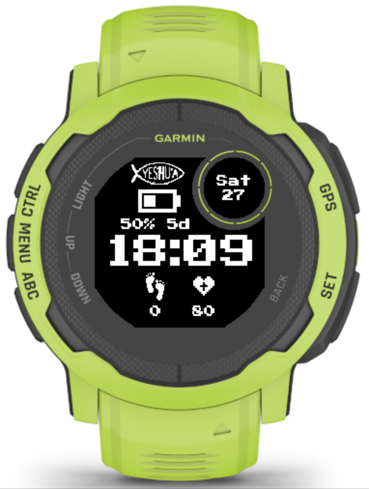

# Garmin Instinct 2 Retro Watch Face

A custom watch face for the Garmin Instinct 2, featuring a retro digital aesthetic.

## Preview

## Features

- **Retro Digital Design**: Classic 7-segment display style.
- **Battery Status**: prominent battery indicator with percentage and estimated days remaining.
- **Health Metrics**: Displays steps and heart rate.
- **Date & Time**: Clear day, date, and time display.
- **Yeshua Fish Icon**: Custom decorative element.

## Device Support

- Garmin Instinct 2

## Development

This project is built using the Garmin Connect IQ SDK.

### Build Requirements

- Garmin Connect IQ SDK (System 3)
- Compatible Device (Instinct 2)
